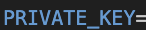

# Auditing System by ISUNCLOUD

_This system allows users to input multiple transactions of various types. Users can specify a time range, and the system will then carry out accounting calculations on the transactions that occurred within this period, generating balance sheets, income statements, and cash flow statements. These reports can then be stored in the SQLite Prisma model. When users request a specific URL, the system will instantly generate and provide the corresponding API._

## Engage the system manually:

_First, download this github zip file, unzip it and find the smart contracts in_

```
src/services/blockchain/contracts
```

### System Deployment:

_Deploy the smart contracts in the following sequence: ( you can deploy the smart contracts with Remix IDE )_

1.parser.sol

2.reports.sol

3.transactionContract.sol (Parser address)

4.getTransactionTimeSpan.sol(TransactionContract address, Parser address)

5.router.sol contract(TransactionContract address, GetTransactionTimeSpan address)

6.transactionHandlers.sol(TransactionContract address, Parser address, Report address), e.g. e00010001Handler.sol

**If user wants to add new transaction types, for example e00010099, user only needs to write an e00010099.sol smart contract, deploy it, and register them in router**

### Operation Flow:

1.  Users start by registering handlers using the registerHandlers function in the `router`, inputting the `TransactionType` (of type `bytes32`) and the `handler’s` address (of type address).


2.  Record data using a `bytes32 array` in the addRecord function of the `router.sol` contract, where each element has been multiplied by 10^18. The first element must be the eventID, and the second should specify the event type. Users must omit the timestamp column to prevent fraudulent events; the system will automatically record the current time.

For example, for the following transaction, the format of the array should be:

[

0x0000000000000000000000000000000000000000000000000000006669727374,

0x0000000000000000000000000000000000000000000000453030303130303031,

0x00000000000000000000000000000000000000000000021e19e0c9bab2400000,

0x0000000000000000000000000000000000000000000000008ac7230489e80000,

0x0000000000000000000000000000000000000000000000000de0b6b3a7640000,

0x0000000000000000000000000000000000000000000000000e043da617250000

]

 

 

Which in decimal:

[

“first”, (eventID)

”E00010001”, (transactionType)

10000000000000000000000, (EP001)

10000000000000000000, (EP002)

1000000000000000000, (EP003)

1010000000000000000 (EP005)

]

, notice that every number has been multipulied by 10^18.

3.  In order to create report(s) in a time span, the users first set rates and reportID on `setRate` function in `router.sol`. For example, for the following example, the user should input a `bytes32 array` as the following format:

[

0x0000000000000000000000000000000000000000000000000dbd2fc137a30000,

0x000000000000000000000000000000000000000000000056bc75e2d631000000,

0x0000000000000000000000000000000000000000000000000000000000006590,

0x66697273745f7265706f72740000000000000000000000000000000000000000

]

Which in decimal stands for:

[

990000000000000000, (SP002)

1600000000000000000000, (SP003)

26000000000000000000000, (SP004)

”first_report” (reportID)

]


The users then interact with the `filterTransactionsInRange` function by inputing startTime(uint256), endTime(uin256), and reportID(bytes32) to set a specific time span. This function employs the `eventID` as primary keys and using `reportID` to organize reports under the `reportID`, preventing any disarray. It then retrieves and returns the transactions that occurred within the specified time span, without providing the full dataset.(S07 - S08)

 

4.  Then the system will pass those transactions which had been filtered in a time span to calculating functions (use eventID to determine which one), the calculating functions first use `iParser.sol` function to change bytes32 into string or int256 and then calculate data with planned formula.

5.  After calculating calculating get a 3D array from `iReports.sol`, and then add results into the respective column.

6.  We can check the numbers is correct or not by calling the function getValue(reportID, reportType, reportColumn) in reports.sol. There are three options to fill in the reportType, ‘balanceSheet’, ‘comprehensiveIncome’, ‘cashFlow’. Then input the ‘reportColumn’ to check the respective column.


## Engage the system with hardhat and run with scripts ( using iSunCoin as blockchain testnet )

### Environment settings:

1. Download this github zip file, unzip it.

2. Open your terminal and "cd" into the file.

3. If you don't have node.js in your computer go to [Node,js](https://nodejs.org/en) and download it (LTS recommended)

4. Run the following command to install npx:

```
npm i -g npx
```

5. Run the following comand to install hardhat:

```
npm i
```

6. Create a **.env** file in root directory of this project and set your PRIVATE_KEY and INFURA_API_KEY:

```
vim .env
```

and set your private key:



### Run the scripts:

1. Deploy the necessary smart contracts:

```
npx hardhat run src/services/blockchain/scripts/1.deploy.js --network iSunCoin
```

2. Deploy the transactions handlers' smart contracts:

```
npx hardhat run src/services/blockchain/scripts/2.deploy_handlers.js --network iSunCoin
```

check your .env file to see if smart contracts' addresses have been recorded successfully.

3. Register the handlers into the system:

```
npx hardhat run src/services/blockchain/scripts/3.register_handler.js --network iSunCoin
```

in the console you shall fill in the transaction type(as bytes32) and the handler address:


you will transaction hash if the handler was successfully registered

4. Record transaction data:

```
npx hardhat run src/services/blockchain/scripts/4.transaction_record.js  --network iSunCoin
```

fill in the data (please refer to the section "Operation Flow" to learn the data format)such as:


5. Set current exchange rate and report ID:

```
npx hardhat run src/services/blockchain/scripts/5.set_rate.js  --network iSunCoin
```


6. Set a time span and input the reportID to calculate the transactions within the time span to generate reports:

```
npx hardhat run src/services/blockchain/scripts/6.set_time_span.js --network iSunCoin
```

(for now you only need to input the reportID, since the time span was set as trasactionTime +1 and -1)


7. check the report columns:

```
npx hardhat run src/services/blockchain/scripts/7.check_column.js --network iSunCoin
```


### Run the auto test:

Enter the following command, this script will automatically deploy, register, enter fixed testing data and check if the answers meet as expected.

```
npx hardhat run src/services/blockchain/scripts/auto_check.js --network iSunCoin
```


## Write data into sqlite database and request API from nextjs

1. **"cd"** into **"auditing_system_api"** file

2. run the following command to install prisma client.

```
npm i
```

3. Set a .env file in **"auditing_system_api"**, you can copy content in **".env"** from the root direction.

4. Adding a **"REPORT_NAME"** in **"auditing_system_api/.env"** and the value of **"REPORT_NAME"** should be the report you want to write into database and request API. For example:

```
REPORT_NAME=first_report
```

5. Install dotenv:

```
npm install dotenv
```

6. Create a **"dev.db"** file under **"auditing_system_api/prisma"**

7. Run the following command to migrate table into database:

```
npx prisma migrate deploy
npx prisma migrate dev --name init
```

8. Run the following command to write data into database(take balanceSheet for example):

```
node pages/api/v1/balance_sheet_prisma.js
```

You can go to prisma/dev.db ,refresh it, to see if it's successfully writen.

9. Run the following command to open local server:

```
npm run dev
```

10. Go to the local server's url(for example: http://localhost:3000/api/v1), and enter

```
http://localhost:3000/api/v1/balance_sheet_api
```

to see if API has output as expected.

## Revert conditions

1. When registering an eventTypeHandler that already exists.

2. When inputting data into the addRecord function in the router, ensure that data.length is not less than 3.

3. When inputting data into the addRecord function in the router, ensure that the eventID has not already been used.

4. When inputting data into the addRecord function in the router, check if the transaction type handler is registered.

5. When inputting an eventID into the setRates function in the router, ensure that the report ID has not already been used.

6. When inputting an eventID into the filterTransactionsInRange function in the router, ensure that the report ID has not already been used.

7. Ensure data.length matches the eventType's data.length requirement. For example, for E00010001, the data should have exactly 6 elements, but revert occur if the user inputs more or fewer elements.

8. When registering a handler with non-contract addrss.

9. When registering a handler with 0x0 address.

10. When reentrancy attack in transaction contract, revert it using reentrancy guard locker.

## System Class Diagram:


## Sequence Diagram:

record transaction data:


give time span and read reports:


